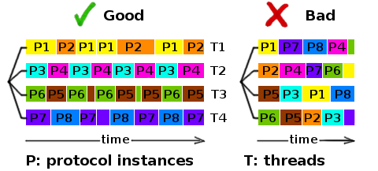

About
=====
.. _imaplib2: https://sourceforge.net/projects/imaplib2/
.. _imaplib: https://docs.python.org/3/library/imaplib.html
.. _asyncio: https://docs.python.org/3/library/asyncio.html

.. image:: https://travis-ci.org/bamthomas/aioimaplib.png?branch=master
   :alt: Build status
   :target: https://travis-ci.com/bamthomas/aioimaplib

.. image:: https://coveralls.io/repos/github/bamthomas/aioimaplib/badge.svg
   :target: https://coveralls.io/github/bamthomas/aioimaplib

This library is inspired by imaplib_ and imaplib2_ from Piers Lauder, Nicolas Sebrecht, Sebastian Spaeth. Some utilities functions are taken from imaplib/imaplib2 thanks to them.

The aim is to port the imaplib with asyncio_, to benefit from the sleep or treat model.

It runs with python 3.5, 3.6, 3.7, 3.8, 3.9.

Example
-------

::

    import asyncio
    from aioimaplib import aioimaplib

    async def check_mailbox(host, user, password):
        imap_client = aioimaplib.IMAP4_SSL(host=host)
        await imap_client.wait_hello_from_server()

        await imap_client.login(user, password)

        res, data = await imap_client.select()
        print('there is %s messages INBOX' % data[0])

        await imap_client.logout()

    if __name__ == '__main__':
        loop = asyncio.get_event_loop()
        loop.run_until_complete(check_mailbox('my.imap.server', 'user', 'pass'))

**Beware** that the IMAP4.close() function is an IMAP function that is closing the selected mailbox, thus passing from SELECTED state to AUTH state. It **does not close** the TCP connection.
The way to close TCP connection properly is to logout.

IDLE command
------------
.. _RFC2177: https://tools.ietf.org/html/rfc2177

The RFC2177_ is implemented, to be able to wait for new mail messages without using CPU. The responses are pushed in an async queue, and it is possible to read them in real time. To leave the IDLE mode, it is necessary to send a "DONE" command to the server.

::

    async def wait_for_new_message(host, user, password):
        imap_client = aioimaplib.IMAP4_SSL(host=host)
        await imap_client.wait_hello_from_server()

        await imap_client.login(user, password)
        await imap_client.select()

        idle = await imap_client.idle_start(timeout=10)
        while imap_client.has_pending_idle():
            msg = await imap_client.wait_server_push()
            print(msg)
            if msg == STOP_WAIT_SERVER_PUSH:
                imap_client.idle_done()
                await asyncio.wait_for(idle, 1)

        await imap_client.logout()

    if __name__ == '__main__':
            loop = asyncio.get_event_loop()
            loop.run_until_complete(wait_for_new_message('my.imap.server', 'user', 'pass'))

Or in a more event based style (the IDLE command is closed at each message from server):

::

   async def idle_loop(host, user, password):
      imap_client = aioimaplib.IMAP4_SSL(host=host, timeout=30)
      await imap_client.wait_hello_from_server()

      await imap_client.login(user, password)
      await imap_client.select()

      while True:
         print((await imap_client.uid('fetch', '1:*', 'FLAGS')))

         idle = await imap_client.idle_start(timeout=60)
         print((await imap_client.wait_server_push()))

         imap_client.idle_done()
         await asyncio.wait_for(idle, 30)

Threading
---------
.. _asyncio.Event: https://docs.python.org/3.4/library/asyncio-sync.html#event
.. _asyncio.Condition: https://docs.python.org/3.4/library/asyncio-sync.html#condition
.. _supervisor: http://supervisord.org/

The IMAP4ClientProtocol class is not thread safe, it uses asyncio.Event_ and asyncio.Condition_ that are not thread safe, and state change for pending commands is not locked.

It is possible to use threads but each IMAP4ClientProtocol instance should run in the same thread :

Each color rectangle is an IMAP4ClientProtocol instance piece of code executed by the thread asyncio loop until it reaches a yield, waiting on I/O.

For example, it is possible to launch 4 mono-threaded mail-fetcher processes on a 4 cores server with supervisor_, and use a distribution function like len(email) % (process_num) or whatever to share equally a mail account list between the 4 processes.

IMAP command concurrency
------------------------

IMAP protocol allows to run some commands in parallel. Four rules are implemented to ensure responses consistency:

1. if a sync command is running, the following requests (sync or async) must wait
2. if an async command is running, same async commands (or with the same untagged response type) must wait
3. async commands can be executed in parallel
4. sync command must wait pending async commands to finish

Logging
-------
.. _howto: https://docs.python.org/3.4/howto/logging.html#configuring-logging-for-a-library

As said in the logging howto_ the logger is defined with ::

    logger = logging.getLogger(__name__)

Where name is 'aioimaplib.aioimaplib'. You can set the logger parameters, either by python API ::

    aioimaplib_logger = logging.getLogger('aioimaplib.aioimaplib')
    sh = logging.StreamHandler()
    sh.setLevel(logging.DEBUG)
    sh.setFormatter(logging.Formatter("%(asctime)s %(levelname)s [%(module)s:%(lineno)d] %(message)s"))
    aioimaplib_logger.addHandler(sh)

Or loading config file (for example with logging.config.dictConfig(yaml.load(file))) with this piece of yaml file::

    loggers:
    ...
      aioimaplib.aioimaplib:
        level: DEBUG
        handlers: [syslog]
        propagate: no
    ...

Tested with
-----------

- dovecot 2.2.13 on debian Jessie
- gmail with imap and SSL
- outlook with SSL
- yahoo with SSL
- free.fr with SSL
- orange.fr with SSL
- mailden.net with SSL

Develop
=======

Developers are welcome ! If you want to improve it, fix bugs, test it with other IMAP servers, give feedback, thank you for it.

To develop, just run::

    virtualenv --python=python3.4 venv
    source venv/bin/activate
    python setup.py develop
    pip install -r dev-requirements.txt
    nosetests

To add an imaplib or imaplib2 command you can :

- add the function to the testing imapserver with a new imaplib or imaplib2 server test, i.e. test_imapserver_imaplib.py or test_imapserver_imaplib2.py respectively;
- then add the function to the aioimaplib doing almost the same test than above but the async way in test_aioimaplib.py.

Not unit tested
---------------
- PREAUTH

TODO
----
.. _rfc3501: https://tools.ietf.org/html/rfc3501
.. _rfc4978: https://tools.ietf.org/html/rfc4978
.. _rfc4314: https://tools.ietf.org/html/rfc4314
.. _rfc2087: https://tools.ietf.org/html/rfc2087
.. _rfc5256: https://tools.ietf.org/html/rfc5256
.. _rfc2971: https://tools.ietf.org/html/rfc2971
.. _rfc2342: https://tools.ietf.org/html/rfc2342
.. _rfc4469: https://tools.ietf.org/html/rfc4469

- 23/25 IMAP4rev1 commands are implemented from the main rfc3501_. 'STARTTLS' and 'AUTHENTICATE' are still missing.
- 'COMPRESS' from rfc4978_
- 'SETACL' 'DELETEACL' 'GETACL' 'MYRIGHTS' 'LISTRIGHTS' from ACL rfc4314_
- 'GETQUOTA': 'GETQUOTAROOT': 'SETQUOTA' from quota rfc2087_
- 'SORT' and 'THREAD' from the rfc5256_
- 'ID' from the rfc2971_
- 'NAMESPACE' from rfc2342_
- 'CATENATE' from rfc4469_
- tests with other servers

If it goes wrong
----------------
Sometimes you break things and you don't understand what's going on (I always do). For this library I have two related tools:

- ngrep on the imap test port : sudo ngrep -d lo port 12345
- activate debug logs changing INFO to DEBUG at the top of the mock server and the aioimaplib
